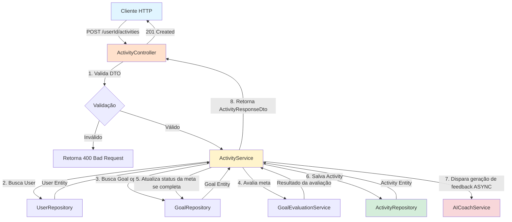
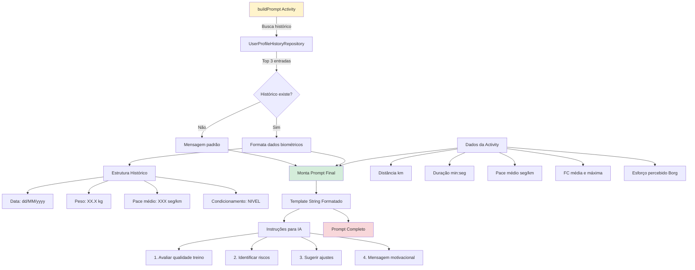
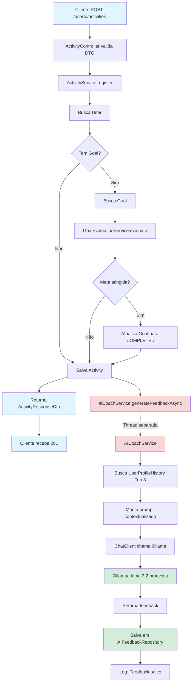

# Arquitetura do Projeto Ritmo

## Visão Geral

O **Ritmo** é uma plataforma de wellness focada em treinamento de corrida, que utiliza inteligência artificial (Ollama/Llama 3.2) para fornecer feedback personalizado aos atletas. A arquitetura segue o padrão de **camadas** (Layered Architecture) com separação clara de responsabilidades.

## Estrutura de Camadas

### 1. **API Layer** (`api/`)
Camada de apresentação responsável por expor endpoints REST e gerenciar requisições HTTP.

**Componentes:**
- **Controllers**: Recebem requisições HTTP, validam dados de entrada e delegam processamento para a camada de serviços
- **DTOs (Data Transfer Objects)**: Objetos de transferência de dados para comunicação cliente-servidor
- **Mappers**: Conversores entre entidades de domínio e DTOs

**Principais Controllers:**
- `UserController`: Gerenciamento de usuários (CRUD)
- `ActivityController`: Registro de atividades/treinos
- `TrainingPlanController`: Gerenciamento de planos de treino
- `ChatController`: Interface para interação com a IA
- `AvailabilityController`: Gerenciamento de disponibilidade dos usuários

### 2. **Domain Layer** (`domain/`)
Camada de domínio contendo a lógica de negócio e regras da aplicação.

**Componentes:**
- **Services**: Implementam regras de negócio e orquestram operações
- **Models**: Entidades de domínio (JPA entities)
- **Repositories**: Interfaces de acesso a dados (Spring Data JPA)

**Principais Services:**
- `UserService`: Lógica de negócio de usuários
- `ActivityService`: Processamento de atividades, avaliação de metas e integração com IA
- `TrainingPlanService`: Gerenciamento de planos de treino
- `GoalEvaluationService`: Avaliação de metas através de estratégias

**Repositories:**
- `UserRepository`: Acesso a dados de usuários
- `ActivityRepository`: Persistência de atividades
- `AIFeedbackRepository`: Armazenamento de feedbacks gerados pela IA
- `UserProfileHistoryRepository`: Histórico biométrico dos usuários
- `GoalRepository`: Gerenciamento de metas

### 3. **Infrastructure Layer** (`infrastructure/`)
Camada de infraestrutura responsável por integrações externas e configurações técnicas.

**Componentes:**
- **AICoachService**: Serviço de integração com Ollama/Llama 3.2 para geração de feedback
- Configurações de segurança, banco de dados, e outros serviços externos

## Fluxo de Dados: Cliente → Repository



### Descrição do Fluxo

1. **Cliente envia requisição**: POST com dados do treino (distância, duração, pace, etc.)
2. **Controller valida**: `ActivityController` valida o DTO usando Bean Validation
3. **Service processa**: `ActivityService` orquestra toda a lógica:
   - Busca o usuário no `UserRepository`
   - Se houver meta associada, busca no `GoalRepository`
   - Avalia se a meta foi atingida usando `GoalEvaluationService`
   - Atualiza status da meta para COMPLETED se necessário
   - Persiste a atividade no `ActivityRepository`
   - **Dispara processamento assíncrono** do feedback IA
4. **Resposta imediata**: Retorna 201 com dados da atividade e mensagem de processamento

## Integração com IA (Ollama/Llama 3.2)

### Processamento Assíncrono

O `AICoachService` opera de forma **assíncrona** para não bloquear o fluxo principal de registro de atividades.

```mermaid
graph TD
    A[ActivityService.register] -->|Salva Activity| B[ActivityRepository]
    B -->|Activity salva| C[aiCoachService.generateFeedbackAsync]
    
    C -->|@Async Thread Pool| D[AICoachService]
    A -->|Retorna imediatamente| E[Cliente recebe 201]
    
    D -->|1. Busca histórico biométrico| F[UserProfileHistoryRepository]
    F -->|Top 3 registros| D
    D -->|2. Monta prompt contextualizado| G[buildPrompt]
    G -->|Prompt formatado| D
    D -->|3. Envia para Ollama| H[ChatClient Spring AI]
    H -->|Chama Ollama API| I[Ollama/Llama 3.2]
    I -->|Resposta IA| H
    H -->|String feedback| D
    D -->|4. Persiste feedback| J[AIFeedbackRepository]
    J -->|Feedback salvo| K[Processo concluído]
    
    style C fill:#f8d7da
    style D fill:#f8d7da
    style I fill:#d4edda
    style E fill:#e1f5ff
```

### Configuração Assíncrona

O método `generateFeedbackAsync` utiliza:
- **@Async("aiTaskExecutor")**: Executa em thread pool dedicada
- **@Transactional**: Garante consistência na persistência do feedback
- **Try-Catch**: Captura erros sem impactar o fluxo principal

```java
@Async("aiTaskExecutor")
@Transactional
public void generateFeedbackAsync(Activity activity) {
    // Processamento em background
}
```

### Formatação de Dados para Contexto da IA

O método `buildPrompt()` formata os dados em um prompt estruturado:



### Estrutura do Prompt

O prompt enviado ao Ollama contém:

**Seção 1: TREINO REALIZADO**
- Distância percorrida (km)
- Duração (minutos e segundos)
- Pace médio (seg/km e min/km)
- Frequência cardíaca média e máxima
- Esforço percebido (escala Borg 6-20)

**Seção 2: HISTÓRICO BIOMÉTRICO**
- Últimas 3 entradas do `UserProfileHistory`
- Data, peso, pace médio e nível de condicionamento
- Permite análise de evolução e detecção de fadiga

**Seção 3: INSTRUÇÕES**
1. Avaliar qualidade do treino (pace, duração, esforço)
2. Identificar riscos de lesão ou fadiga com base no histórico
3. Sugerir ajustes de carga para próximo treino
4. Encerrar com frase motivacional personalizada

### Resposta da IA

A resposta do Ollama é:
1. **Recebida**: Como String pelo `ChatClient` (Spring AI)
2. **Persistida**: No banco de dados via `AIFeedbackRepository`
3. **Associada**: À activity específica através de relacionamento JPA

```java
AIFeedback feedback = new AIFeedback();
feedback.setActivity(activity);
feedback.setFeedbackText(response);
feedback.setModelUsed(modelUsed); // Ex: llama3.2
feedbackRepository.save(feedback);
```

## Papel do AICoachService

### Responsabilidades

1. **Orquestração de Contexto**
   - Coleta dados da atividade registrada
   - Busca histórico biométrico do usuário
   - Formata informações para o modelo de linguagem

2. **Integração com Ollama**
   - Utiliza `ChatClient` do Spring AI
   - Configura modelo via `spring.ai.ollama.chat.model`
   - Envia prompt e recebe resposta

3. **Processamento Assíncrono**
   - Não bloqueia a thread principal
   - Thread pool dedicada (`aiTaskExecutor`)
   - Logging detalhado para rastreabilidade

4. **Persistência de Feedback**
   - Salva resposta da IA no banco
   - Mantém registro do modelo utilizado
   - Relaciona feedback com a atividade

5. **Resiliência**
   - Try-catch para evitar falhas em cascata
   - Logs de erro detalhados
   - Não impacta o registro da atividade

### Configuração do Thread Pool

O `aiTaskExecutor` permite múltiplas chamadas simultâneas ao Ollama sem bloquear outras operações do sistema.

## Fluxo Completo: Registro de Atividade + Feedback IA



## Tecnologias Utilizadas

### Backend
- **Spring Boot**: Framework principal
- **Spring Data JPA**: Camada de persistência
- **Spring AI**: Integração com Ollama
- **PostgreSQL**: Banco de dados relacional

### IA
- **Ollama**: Runtime local para modelos LLM
- **Llama 3.2**: Modelo de linguagem
- **Spring AI ChatClient**: Cliente para comunicação com Ollama

### Assincronismo
- **@Async**: Processamento assíncrono do Spring
- **ThreadPoolTaskExecutor**: Pool de threads dedicado para IA

## Benefícios da Arquitetura

1. **Separação de Responsabilidades**
   - Controllers não conhecem detalhes de persistência
   - Services isolam lógica de negócio
   - Repositories abstraem acesso a dados

2. **Testabilidade**
   - Cada camada pode ser testada isoladamente
   - Mocks e stubs facilitam testes unitários

3. **Escalabilidade**
   - Processamento IA assíncrono não bloqueia operações principais
   - Thread pool configurável para ajustar capacidade

4. **Manutenibilidade**
   - Mudanças em uma camada não afetam outras
   - Código organizado e fácil de navegar

5. **Performance**
   - Resposta imediata ao cliente (201 Created)
   - Processamento IA em background
   - Consultas otimizadas (Top 3 histórico)

## Considerações de Design

### Transações
- `@Transactional` nos métodos de serviço
- Read-only quando apropriado
- Isolamento de transações assíncronas

### Segurança
- `@PreAuthorize` nos controllers
- Validação de propriedade do recurso (userId)
- Criptografia de senhas (BCrypt)

### Observabilidade
- Logging estruturado com `@Slf4j`
- Rastreamento de operações assíncronas
- Informações de debug em desenvolvimento

## Evolução Futura

### Melhorias Sugeridas
1. **Cache**: Redis para histórico biométrico frequentemente acessado
2. **Event-Driven**: Uso de eventos para feedback IA (Spring Events ou Kafka)
3. **Rate Limiting**: Controle de chamadas à API do Ollama
4. **Retry Mechanism**: Tentativas automáticas em caso de falha na IA
5. **Streaming**: Respostas em streaming do Ollama para feedbacks longos
6. **Webhooks**: Notificar cliente quando feedback estiver pronto
